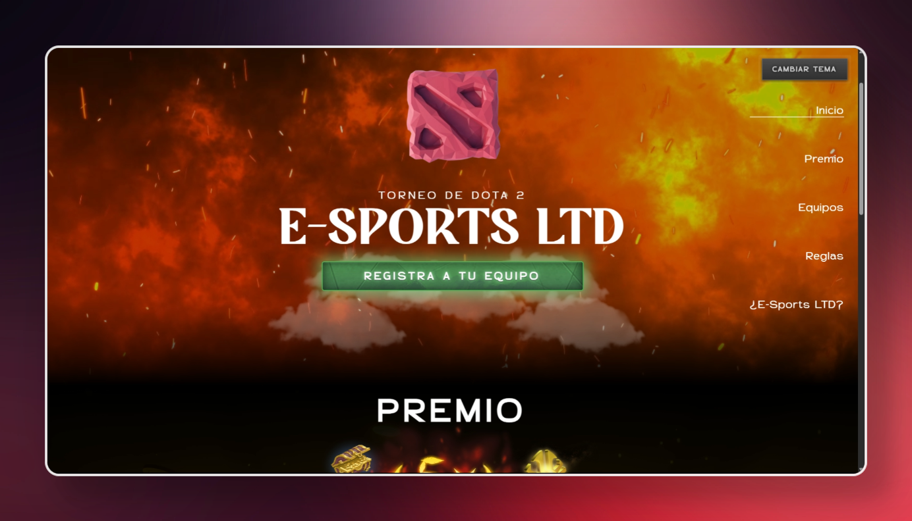

# Web site to ltd dota fest 2025

<a href="https://ltddota.sistemasudh.com/">

</a>

## 🧞 Commands Setup

All commands are run from the root of the project, from a terminal:

| Command                   | Action                                           |
| :------------------------ | :----------------------------------------------- |
| `npm install`             | Installs dependencies                            |
| `npm run dev`             | Starts local dev server at `localhost:3011`      |
| `npm run build`           | Build your production site to `./dist/`          |
| `npm run preview`         | Preview your build locally, before deploying     |
| `npm run astro ...`       | Run CLI commands like `astro add`, `astro check` |
| `npm run astro -- --help` | Get help using the Astro CLI                     |


## 🚀 Project Structure


```text
dota-fest-udh
├── README.md
├── astro.config.mjs
├── package-lock.json
├── package.json
├── public
│   ├── cursors
│   │   ├── pointer.png
│   │   └── select.png
│   ├── favicon.svg
│   ├── fonts
│   │   ├── Agency.woff2
│   │   ├── Alifira.woff2
│   │   └── Aminute.woff2
│   ├── screenhome.png
│   └── textures
│       └── dota_pattern.png
├── src
│   ├── assets
│   │   ├── astro.svg
│   │   ├── background.svg
│   │   ├── imgs
│   │   │   ├── bg_bounty_run.jpg
│   │   │   ├── bounty_run.png
│   │   │   ├── cloud.png
│   │   │   ├── cloud_white.png
│   │   │   ├── coin_booster.png
│   │   │   ├── combo.png
│   │   │   ├── escudoTI.png
│   │   │   ├── logo_3d_blue.png
│   │   │   ├── logo_3d_red.png
│   │   │   ├── ltd_sponsor.png
│   │   │   ├── maiden.jpg
│   │   │   ├── pa.jpg
│   │   │   ├── paisi_sponsor.webp
│   │   │   ├── reglas.png
│   │   │   ├── rewards_coins.png
│   │   │   ├── rewards_treasures.png
│   │   │   ├── terror.jpg
│   │   │   ├── tireglas.png
│   │   │   ├── udh_sponsor.webp
│   │   │   ├── yape_qr.jpeg
│   │   │   └── yape_qr.png
│   │   └── videos
│   │       ├── dota.mp4
│   │       ├── file3.mp4
│   │       └── file4.mp4
│   ├── components
│   │   ├── NavItem.astro
│   │   ├── Registroo.astro
│   │   ├── Sidebar.astro
│   │   ├── SidebarMobile.astro
│   │   ├── Title.astro
│   │   ├── Welcome.astro
│   │   ├── buttons
│   │   │   ├── ButtonDanger.astro
│   │   │   ├── ButtonDefault.astro
│   │   │   ├── ButtonPrimary.astro
│   │   │   ├── ButtonPrimaryShadow.astro
│   │   │   └── RefDanger.astro
│   │   └── icons
│   │       ├── IconMenu.astro
│   │       └── IconX.astro
│   ├── layouts
│   │   └── Layout.astro
│   ├── pages
│   │   ├── acerca.astro
│   │   ├── api
│   │   │   ├── registrar-equipo.ts
│   │   │   └── verificar-estudiante.ts
│   │   ├── index.astro
│   │   └── registro.astro
│   ├── partials
│   │   ├── AboutLTD.astro
│   │   ├── Award.astro
│   │   └── Teams.astro
│   ├── styles
│   │   └── global.css
│   └── turso.ts
└── tsconfig.json
```